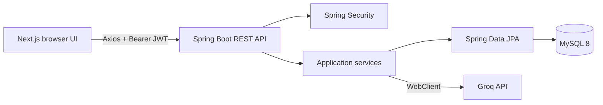

# AI Interview Coach

AI Interview Coach is a complete local full-stack application for realistic IT and Non-IT interview practice. It provides adaptive one-question-at-a-time sessions, persistent transcripts, detailed reports, searchable history, analytics, and profile management.

## Features

- IT interviews across software, data, cloud, security, support, and custom domains with technical, coding, conceptual, debugging, scenario, system-design, and mixed modes.
- Non-IT interviews across HR, support, sales, marketing, operations, finance, teaching, leadership, and custom domains with behavioural, situational, communication, customer-handling, role-specific, and mixed modes.
- Backend-driven options, follow-ups, refresh recovery, completion, abandonment, reports, dashboards, history filters/pagination/deletion, and strict per-user ownership.
- Responsive authenticated UI with validation, loading, empty, error, and invalid-session states.

## Technology stack

- Frontend: Next.js 16 App Router, React 19, TypeScript, Tailwind CSS, React Hook Form, Zod, Axios, Recharts, Lucide, Vitest, Testing Library, Playwright.
- Backend: Java 21, Spring Boot 3.5, WebClient, Spring Data JPA, Spring Security, JWT, Flyway, MySQL, Actuator, OpenAPI, JUnit, Mockito, MockMvc.
- AI: configurable Groq OpenAI-compatible API; deterministic provider restricted to the test profile.

## Architecture



Details: [architecture](docs/architecture.md), [API flow](docs/api-flow.md), [database](docs/database-design.md), and [security](docs/security.md).

## Folder structure

```text
backend/      Spring Boot API, migrations, and backend tests
frontend/     Next.js application, unit tests, and Playwright tests
docs/         Specification, design, setup, testing, and build status
README.md     Overview and quick start
LICENSE       Project license
```

## Prerequisites

- Java 21, Maven 3.9+, Node.js 20+ with npm, and MySQL 8+
- A Groq API key for real AI interviews

Verify Java with `java -version`, Node with `node --version`, Maven with `mvn.cmd -version`, and npm with `npm.cmd --version`.

## Local setup

Create the database:

```sql
CREATE DATABASE ai_interview_coach CHARACTER SET utf8mb4 COLLATE utf8mb4_0900_ai_ci;
CREATE USER 'ai_coach'@'localhost' IDENTIFIED BY 'choose-a-local-password';
GRANT ALL PRIVILEGES ON ai_interview_coach.* TO 'ai_coach'@'localhost';
```

Start the backend from PowerShell. `.env.example` is a reference; Spring Boot does not automatically import `.env` files.

```powershell
$env:SPRING_PROFILES_ACTIVE='dev'
$env:DB_URL='jdbc:mysql://localhost:3306/ai_interview_coach'
$env:DB_USERNAME='ai_coach'
$env:DB_PASSWORD='your-local-database-password'
$env:JWT_SECRET='generate-a-long-random-secret-of-at-least-32-bytes'
$env:JWT_EXPIRATION='3600000'
$env:GROQ_API_KEY='your-groq-api-key'
$env:GROQ_API_BASE_URL='https://api.groq.com/openai/v1'
$env:GROQ_MODEL='llama-3.3-70b-versatile'
$env:GROQ_TIMEOUT='20s'
$env:APP_FRONTEND_URL='http://localhost:3000'
cd backend
mvn.cmd spring-boot:run
```

Flyway applies V1-V5 automatically. In a second PowerShell window:

```powershell
cd frontend
$env:NEXT_PUBLIC_API_URL='http://localhost:8080'
npm.cmd install
npm.cmd run dev
```

Open `http://localhost:3000`. See the [local setup guide](docs/local-setup-guide.md) for a clean-machine procedure.

## Testing commands

```powershell
cd backend
mvn.cmd test

cd ../frontend
npm.cmd run typecheck
npm.cmd run lint
npm.cmd run test
npm.cmd run build
npm.cmd audit
```

Playwright requires a running disposable MySQL database, backend, and frontend. Then run `npm.cmd run test:e2e`. The guarded real-MySQL backend tests require `MYSQL_INTEGRATION_TESTS=true` plus database variables. See the [testing guide](docs/testing-guide.md).

## Local URLs

- Frontend: http://localhost:3000
- Backend: http://localhost:8080
- Swagger: http://localhost:8080/swagger-ui/index.html
- OpenAPI: http://localhost:8080/v3/api-docs
- Health: http://localhost:8080/actuator/health

## Troubleshooting

- Database refused: start MySQL and verify its port, schema, user grants, and `DB_URL`.
- Flyway validation failed: restore applied migrations and create a new migration for changes.
- CORS rejected: make `APP_FRONTEND_URL` exactly match the browser origin before backend startup.
- AI unavailable: verify the Groq key, URL, model, quota, and network. Never use the test provider for normal use.
- Wrong frontend API: set `NEXT_PUBLIC_API_URL` before starting/building Next.js.
- PowerShell blocks `npm.ps1`: use `npm.cmd` and `npx.cmd`.

## Known limitations and future enhancements

- Live AI quality and availability depend on Groq, its configured model, quota, and network. No key was available for the final smoke test.
- JWTs use browser local storage. Production hardening could use secure HttpOnly cookies and CSRF protection.
- Optional future work: voice interviews, resume-aware prompts, assistive-technology audits, wider browser coverage, observability, containers, and a separately authorized deployment phase.

## Screenshots

Screenshots have not been captured. Suggested future captures are the landing page, setup, active interview, report, dashboard, and history. No screenshot is represented as existing.

## Author

Built as the AI Interview Coach portfolio project. Project ownership remains with the repository owner.

## Status

Phases 1-12 are implemented and locally verified. See [build status](docs/build-status.md). No deployment is configured or performed.
