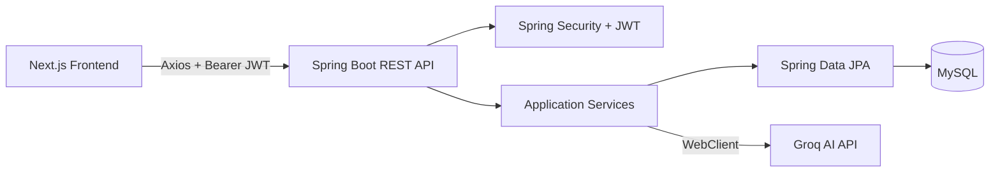

# 🤖 AI Interview Coach

AI Interview Coach is a **full-stack AI-powered interview preparation platform** for IT and Non-IT roles.

It provides realistic, adaptive interview sessions with one question at a time, secure authentication, persistent interview history, AI-generated performance reports, analytics, and personalized feedback.

## 🌐 Live Demo

**Live Application:**
https://ai-interview-coach-nu-sage.vercel.app

**Backend API:**
https://ai-interview-coach-production-0d16.up.railway.app

**Backend Health:**
https://ai-interview-coach-production-0d16.up.railway.app/api/health

**GitHub Repository:**
https://github.com/santhu1711/AI-Interview-Coach

---

## ✨ Features

### 🎯 AI Interview Practice

* IT and Non-IT interview categories
* Role and domain-based interview configuration
* Beginner, Intermediate, and Experienced levels
* Easy, Medium, and Hard difficulty
* Configurable question count
* One-question-at-a-time interview experience
* Adaptive AI follow-up questions
* Real-time answer submission
* Interview progress tracking
* Interview recovery after browser refresh

### 💻 IT Interview Areas

Includes:

* Java
* Spring Boot
* DSA
* SQL
* Python
* JavaScript / TypeScript
* React / Next.js
* Frontend Development
* Backend Development
* Full Stack Development
* DevOps
* Cloud
* Cybersecurity
* AI / Machine Learning
* IoT / Embedded Systems
* System Design
* Testing
* Technical Support
* Custom domains

Interview modes include:

* Technical
* Coding
* Conceptual
* Debugging
* Scenario-Based
* System Design
* Mixed

### 💼 Non-IT Interview Areas

Includes:

* Human Resources
* Customer Support
* Customer Success
* Sales
* Marketing
* Business Development
* Operations
* Project Coordination
* Administration
* Finance
* Banking
* Teaching
* Training
* Recruitment
* Management
* Leadership
* Content Writing
* Custom domains

Interview modes include:

* HR
* Behavioural
* Situational
* Role Specific
* Communication
* Customer Handling
* Leadership
* Mixed

---

## 📊 AI Performance Reports

After completing an interview, users receive a detailed AI-generated report including:

* Overall score
* Pass / Fail verdict
* Performance rating
* Strengths
* Areas for improvement
* Revision topics
* Recommendation
* Question-level feedback

### IT scoring dimensions

* Technical Accuracy
* Conceptual Understanding
* Problem Solving
* Communication
* Confidence

### Non-IT scoring dimensions

* Communication
* Confidence
* Situational Judgement
* Role Understanding
* Problem Solving

---

## 📈 Dashboard & History

The dashboard provides:

* Total interviews
* Completed interviews
* Active interviews
* IT vs Non-IT interview count
* Average score
* Highest score
* Pass percentage
* Strongest domain
* Focus domain
* Score trend charts
* Domain performance analytics

Interview history supports:

* Search
* Filtering
* Sorting
* Pagination
* Resume active interviews
* View reports
* Delete interviews

---

## 🔐 Authentication & Security

* User registration
* Secure login
* BCrypt password hashing
* JWT authentication
* Protected APIs
* User-scoped interview ownership
* Restricted CORS
* Structured security errors
* Sensitive data redaction

Each user can access only their own:

* Interviews
* Messages
* Reports
* History
* Dashboard data

---

## 🛠 Technology Stack

### Frontend

* Next.js 16
* React 19
* TypeScript
* Tailwind CSS
* Axios
* React Hook Form
* Zod
* Recharts
* Lucide Icons
* Vitest
* Testing Library
* Playwright

### Backend

* Java 21
* Spring Boot 3.5
* Spring Security
* JWT
* Spring Data JPA
* Hibernate
* WebClient
* Flyway
* MySQL
* Actuator
* OpenAPI / Swagger
* JUnit
* Mockito
* MockMvc

### AI

* Groq API
* Model: `openai/gpt-oss-120b`
* Structured JSON responses
* Adaptive interview prompts
* Automated response validation
* Corrective retry handling

### Deployment

* **Frontend:** Vercel
* **Backend:** Railway
* **Database:** Railway MySQL
* **AI Provider:** Groq
* **Source Control:** GitHub

---

## 🏗 Architecture



More details:

* [Architecture](docs/architecture.md)
* [API Flow](docs/api-flow.md)
* [Database Design](docs/database-design.md)
* [Security](docs/security.md)
* [Deployment Guide](docs/deployment-guide.md)
* [Testing Guide](docs/testing-guide.md)

---

## 📁 Project Structure

```text
AI-Interview-Coach/
│
├── backend/
│   ├── Spring Boot REST API
│   ├── Spring Security
│   ├── JPA repositories
│   ├── Flyway migrations
│   └── Backend tests
│
├── frontend/
│   ├── Next.js application
│   ├── Authentication
│   ├── Interview UI
│   ├── Dashboard
│   ├── Reports
│   ├── History
│   └── Frontend / E2E tests
│
├── docs/
│   ├── Architecture
│   ├── API design
│   ├── Database design
│   ├── Security
│   ├── Testing
│   └── Deployment
│
├── README.md
└── LICENSE
```

---

## 🧪 Testing

The application was developed using a phase-by-phase build, test, fix, verify, and commit workflow.

### Backend

* **71 backend tests passed**
* Real MySQL integration verified
* Flyway V1–V5 verified
* Authentication and authorization verified
* Ownership isolation verified

### Frontend

* **31 frontend tests passed**
* TypeScript validation passed
* ESLint passed with zero warnings
* Production build passed

### End-to-End

* Playwright real-browser scenarios passed
* Registration and login verified
* JWT restoration verified
* IT interview flow verified
* Non-IT interview flow verified
* Reports verified
* Dashboard verified
* History verified
* Profile updates verified

### Real AI Verification

The real Groq integration was manually verified with:

* AI-generated first question
* Answer submission
* Adaptive follow-up questions
* Full interview completion
* AI-generated performance report

Both **IT and Non-IT interviews were manually tested successfully**.

---

## 💻 Local Setup

### Requirements

* Java 21
* Maven 3.9+
* Node.js 20+
* npm
* MySQL 8+
* Groq API key

### Backend

```powershell
$env:SPRING_PROFILES_ACTIVE='dev'
$env:DB_URL='jdbc:mysql://localhost:3306/ai_interview_coach'
$env:DB_USERNAME='your-db-user'
$env:DB_PASSWORD='your-db-password'
$env:JWT_SECRET='your-secure-jwt-secret'
$env:GROQ_API_KEY='your-groq-api-key'
$env:GROQ_MODEL='openai/gpt-oss-120b'
$env:APP_FRONTEND_URL='http://localhost:3000'

cd backend
mvn spring-boot:run
```

Flyway automatically applies the database migrations.

### Frontend

```powershell
cd frontend

$env:NEXT_PUBLIC_API_URL='http://localhost:8080'

npm.cmd install
npm.cmd run dev
```

Open:

```text
http://localhost:3000
```

---

## 🔗 Local Development URLs

* Frontend: `http://localhost:3000`
* Backend: `http://localhost:8080`
* Swagger: `http://localhost:8080/swagger-ui/index.html`
* OpenAPI: `http://localhost:8080/v3/api-docs`
* Health: `http://localhost:8080/api/health`

---

## 🚀 Production Deployment

### Frontend

Hosted on **Vercel**

https://ai-interview-coach-nu-sage.vercel.app

### Backend

Hosted on **Railway**

https://ai-interview-coach-production-0d16.up.railway.app

### Database

Hosted using **Railway MySQL**

### AI

Powered by **Groq** using:

```text
openai/gpt-oss-120b
```

---

## 📸 Screenshots

Add screenshots here for:

* Landing page
* Dashboard
* Interview Setup
* Live AI Interview
* Performance Report
* Interview History

Example structure:

```markdown
### Dashboard


### Live Interview


### Performance Report


```

---

## 🔮 Future Improvements

Possible future enhancements include:

* Voice-based interviews
* Resume-aware interview questions
* Job-description-based interviews
* Secure HttpOnly cookie authentication
* Advanced AI evaluation
* Interview recording
* More analytics
* Accessibility improvements
* Wider browser testing
* Observability and monitoring

---

## 👨‍💻 Author

**Santhosh S**

GitHub:
https://github.com/santhu1711

LinkedIn:
https://linkedin.com/in/santhosh17

---

## 📌 Project Status

**Completed and deployed ✅**

* Development: ✅
* Backend testing: ✅
* Frontend testing: ✅
* MySQL integration: ✅
* Real Groq AI testing: ✅
* Manual IT interview testing: ✅
* Manual Non-IT interview testing: ✅
* GitHub: ✅
* Railway backend deployment: ✅
* Railway MySQL deployment: ✅
* Vercel frontend deployment: ✅

**Live Demo:**
https://ai-interview-coach-nu-sage.vercel.app
