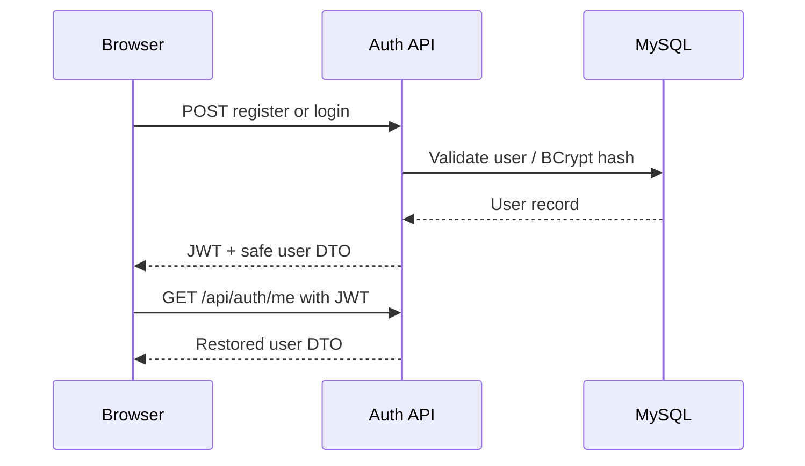
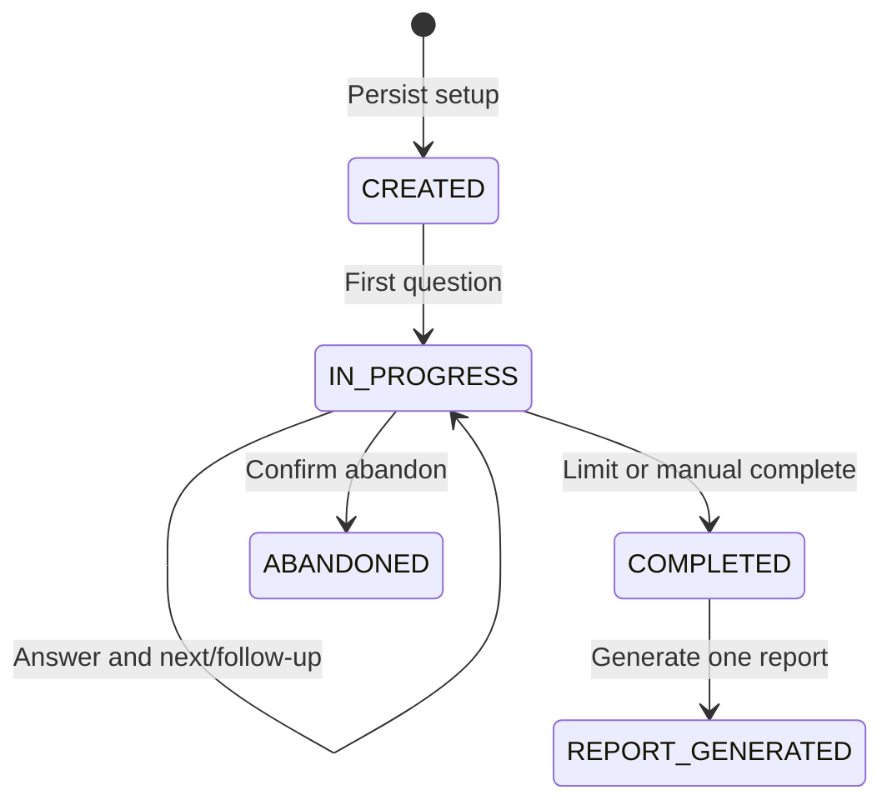
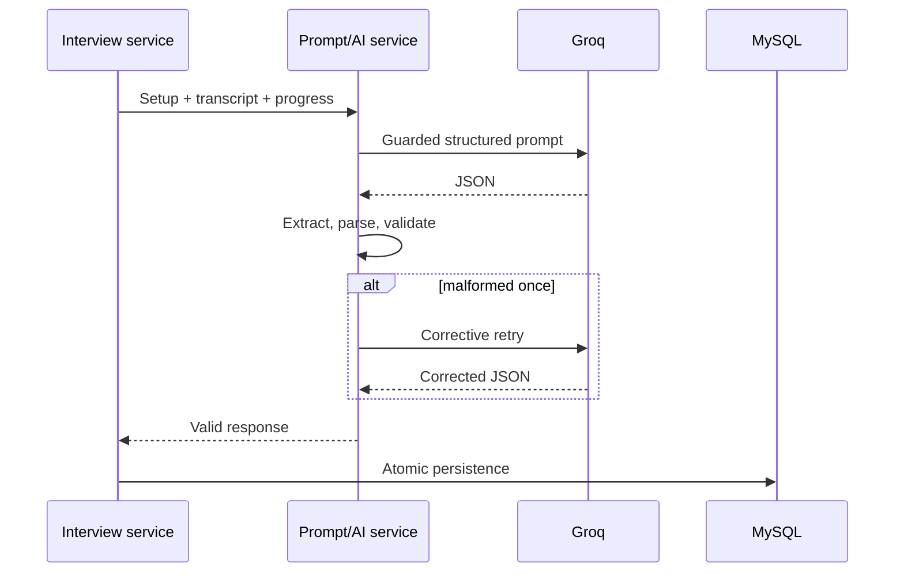

# API and application flows

## Authentication

## Interview lifecycle

`GET /api/interview-options` supplies valid catalogs and constraints. `POST /api/interviews` validates and returns a UUID. Detail GET restores progress/transcript. Answer POST persists one answer and returns one adaptive question. Complete/abandon enforce lifecycle transitions. Report POST/GET creates or restores the single owned report.

## AI flow

Malformed output is not persisted. Transient provider failures receive one bounded retry; API errors are sanitized. Active UI never reveals hints, suggested answers, evaluations, or AI reasoning.

## Endpoints

- Public: health, auth registration/login, Actuator health, Swagger/OpenAPI.
- Authenticated: `/api/auth/me`, interview options and lifecycle/history, reports, dashboard summary/performance, and profile GET/PUT.
- History supports search, category/domain/mode/difficulty/status filters, four sorts, and pagination.

Swagger at `http://localhost:8080/swagger-ui/index.html` is the interactive contract inventory.
