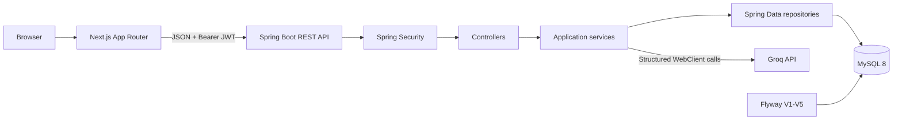

# Architecture

The browser renders public landing/authentication pages and protected dashboard, setup, interview, report, history, and profile pages. Axios centralizes the API URL, JWT attachment, and unauthorized handling. URLs contain only interview UUIDs; state and transcripts are restored from the API.

The backend follows controller → service → repository → MySQL. Controllers accept validated DTOs. Services own lifecycle, configuration, ownership, AI, report, history, analytics, and mapping rules. JPA entities are not exposed.

## Components

- `backend/config`, `security`: security chain, JWT filter, OpenAPI, CORS, and AI configuration.
- `backend/controller`, `dto`: thin REST boundary and safe contracts.
- `backend/service`: authentication, interview lifecycle, AI, reports, history/dashboard, and profile logic.
- `backend/repository`, `entity`: ownership-aware persistence.
- `frontend/src/contexts`, `services`: authentication state and typed API boundary.
- `frontend/src/components`: auth, interview, report, dashboard, history, profile, layout, and reusable UI.

## Profiles

- `dev` uses MySQL and the Groq provider configured by environment variables.
- `test` uses H2 by default and selects deterministic AI. E2E overrides its datasource with disposable real MySQL while retaining repeatable AI behavior.

The deterministic provider is conditional on `app.ai.provider=deterministic-test`; development does not select it.
