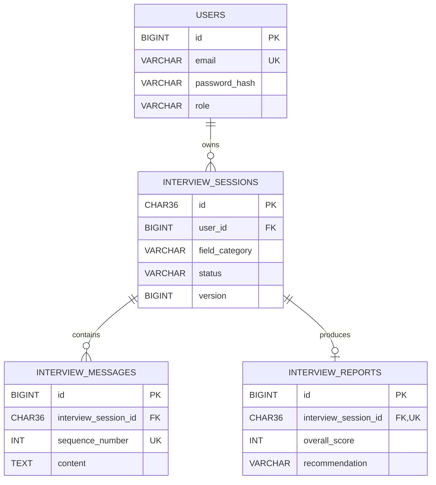

# Database design

MySQL 8 and Flyway own the persistent schema. Applied migrations V1-V5 are immutable; use a new migration for future changes.

## Integrity

- Unique email and BCrypt-only password storage.
- Every session references its owner; session UUIDs are application-generated.
- Database checks cover enums, counts, scores, and custom-domain consistency.
- `(interview_session_id, sequence_number)` preserves unique transcript order.
- One report per session; deletion cascades to messages and reports.
- Ownership/history indexes support scoped access; optimistic versioning protects session updates.

Migrations create users (V1), sessions (V2), messages (V3), reports (V4), and indexes/unique constraints (V5). Real-MySQL tests validate Flyway history, metadata, constraints, enums, CRUD, ordering, ownership, and cascade deletion.
