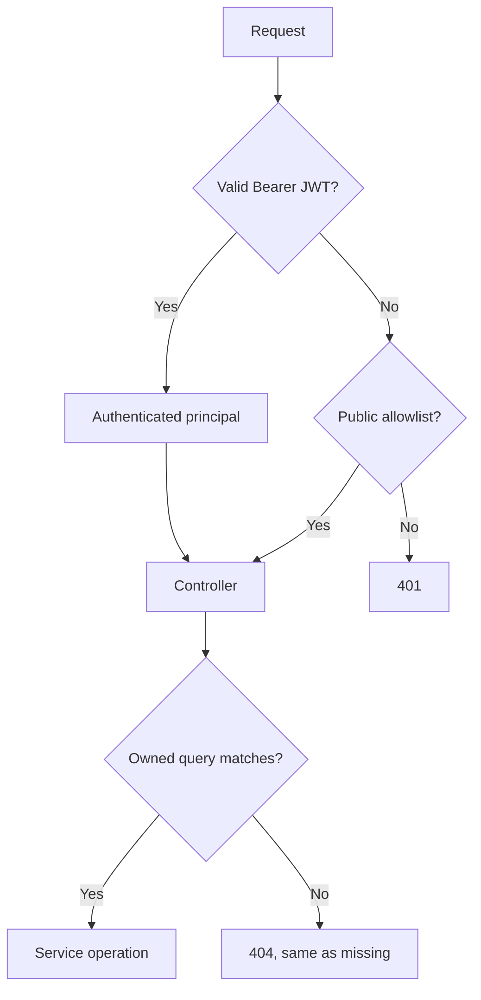

# Security design

- Spring Security is stateless. Signed expiring JWTs protect application APIs.
- BCrypt hashes passwords; hashes and entities never appear in response DTOs.
- Ownership comes from the principal, never a client-provided user ID. Wrong-owner and missing resources share 404 semantics.
- CORS permits only `APP_FRONTEND_URL`, without a wildcard origin.
- Bean Validation plus service rules reject malformed and incompatible inputs. Raw exceptions/provider details are not exposed.
- AI inputs are delimited against prompt injection and structured output is validated before persistence.

`DB_PASSWORD`, `JWT_SECRET`, and `GROQ_API_KEY` are runtime variables. Examples are blank; `.env`, `.runtime`, logs, build output, and test artifacts are ignored.

The frontend stores JWTs in local storage, validates expiry/shape, attaches them centrally, and clears them on HTTP 401. For production, secure HttpOnly cookies with CSRF protection are an optional hardening improvement. Backend authorization remains the security boundary; frontend guards are only user experience.
